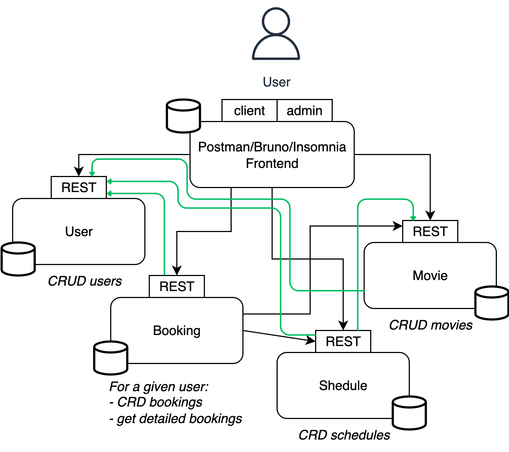

# UE-AD-A1-REST - Mehdi BAGHDADI et Aloïs Fleury

[Lien du TP](https://helene-coullon.fr/pages/ue-ad-fil-25-26/tp-rest/)

## Initialisation et lancement du projet

### Premier lancement du projet (exemple sur Windows)

Il faut créer et lancer un environnement virtuel Python en faisant

    python3 -m venv venv
    .\venv\Scripts\activate

Il faut ensuite installer les packages nécessaires au projet (attention à bien être dans l'environnement virtuel)

    pip install -r requirements.txt

### Lancement d'un projet déjà initialisé

Pour lancer chaque microservice : se placer dans le dossier et exécuter le fichier du même nom avec Python. Exemple sur Windows :
```bash
cd .\booking\
python .\booking.py
```

Attention, il faut bien veiller à ce que le service user soit lancé lorsqu'on veut tester (car pour certaines requêtes, les droits utilisateurs sont vérifiés).

## Architecture utilisée

L'architecture suivie est en microservices et son schéma est le suivant : 



## Tests et exemples

Les tests ont été réalisés sur Insomnia (voir dossier [./insomnia](./insomnia)).

Pour la première partie ne vous souciez pas des fichiers Docker, cela sera abordé par la suite en séance 4.
